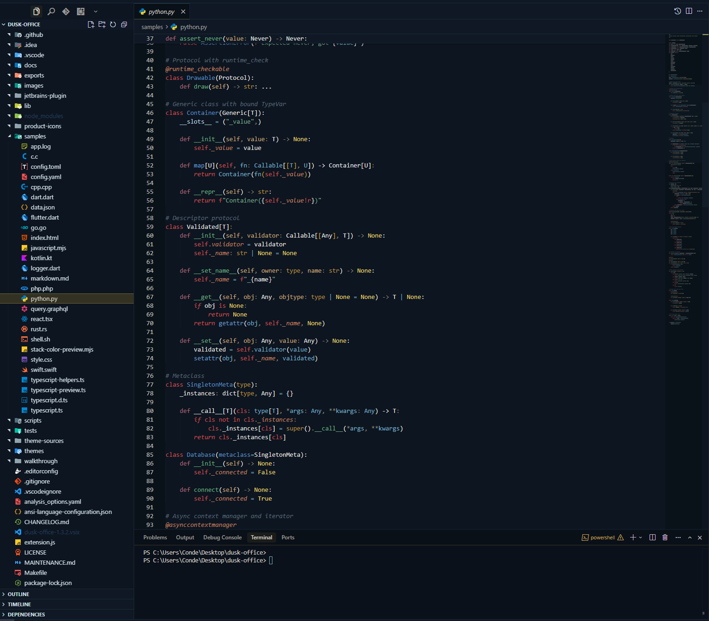
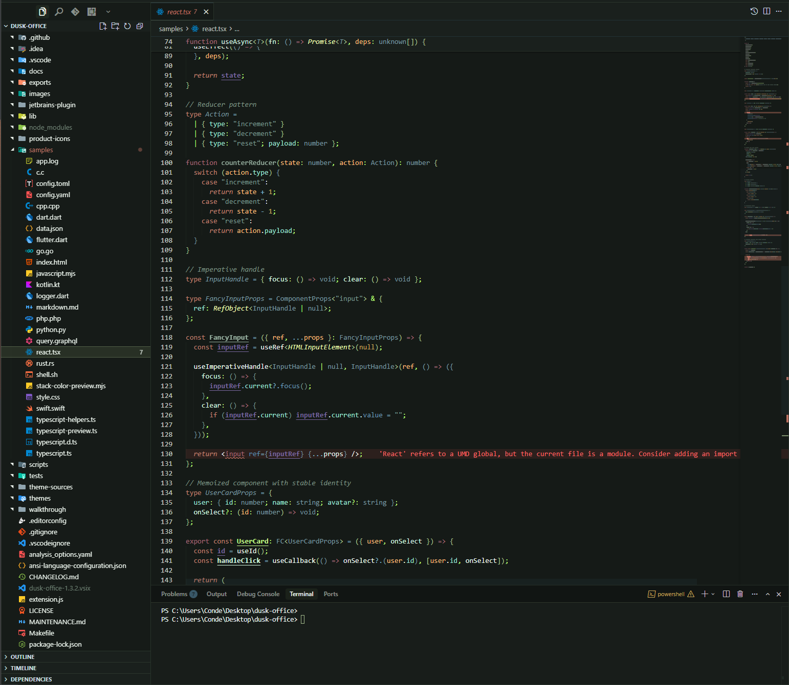
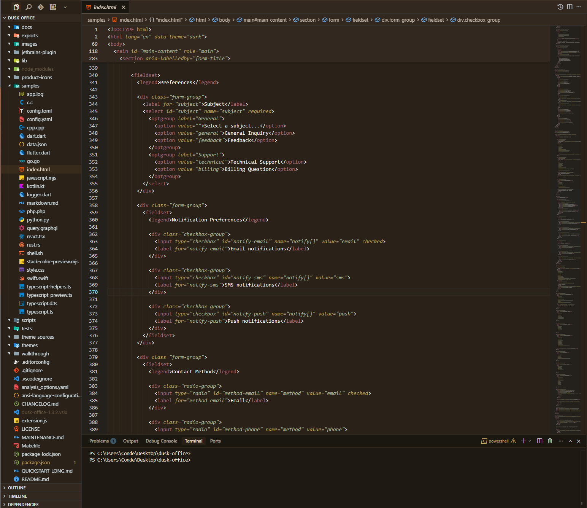
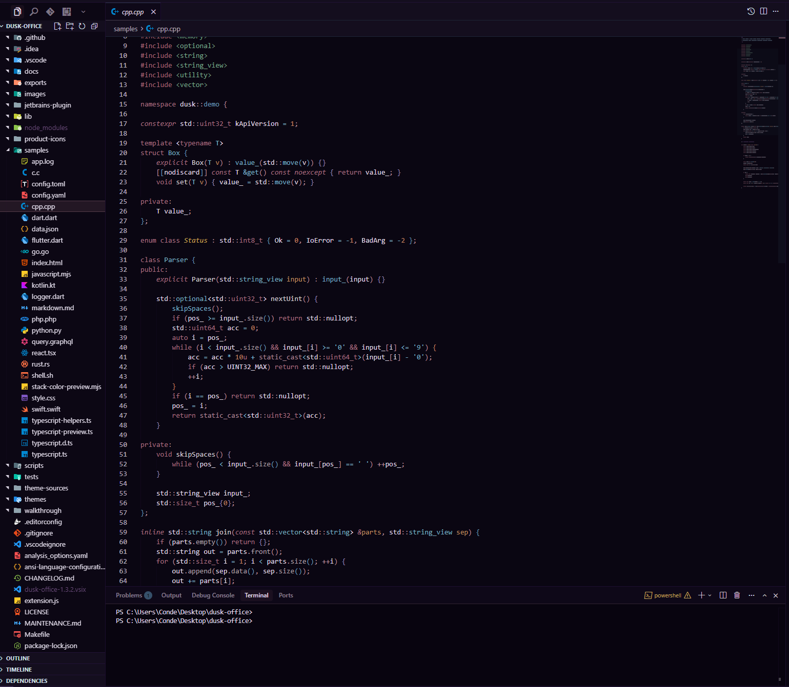
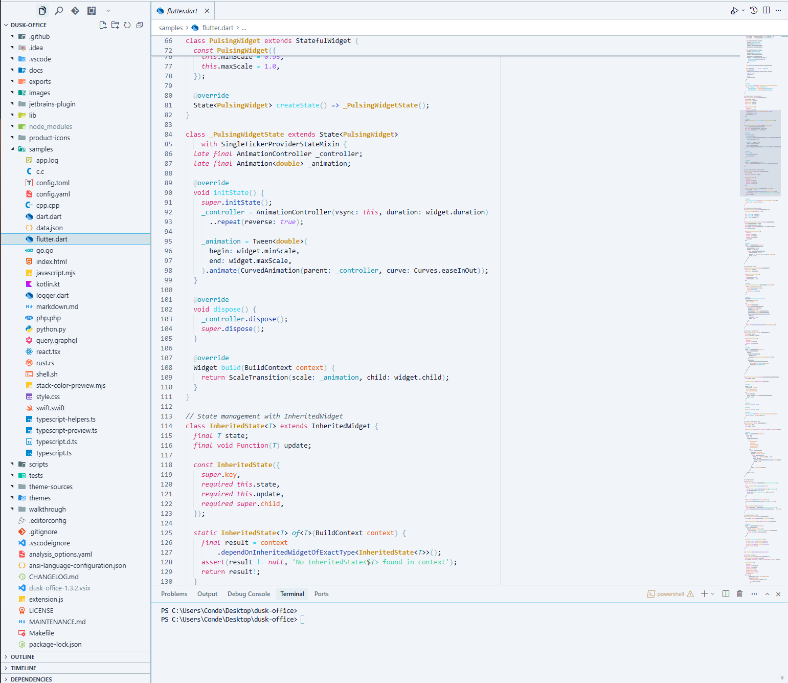

# Dusk Office

[](./LICENSE)
[](https://github.com/SIDIKICONDE/dusk-office/actions/workflows/ci.yml)
[](https://marketplace.visualstudio.com/items?itemName=dekidev.dusk-office)
[](https://marketplace.visualstudio.com/items?itemName=dekidev.dusk-office)
[](https://open-vsx.org/extension/dekidev/dusk-office)
[](https://open-vsx.org/extension/dekidev/dusk-office)
[](https://plugins.jetbrains.com/plugin/31875-dusk-office-themes)
[](https://plugins.jetbrains.com/plugin/31875-dusk-office-themes)

> **Professional theme system for VS Code, Cursor, Windsurf and Open VSX** — **27 WCAG-verified variants** in one coherent family, with **Theme Gallery**, **workspace fingerprint**, **adaptive day/night focus**, and **verified editor/UI contrast**. Built for **finance, audit, banking, cybersecurity, SOC & DevOps** — and long sessions where readability matters.

**Dusk Office** is a polished theme suite for **VS Code**, **Cursor**, and **Windsurf** (plus **Neovim, Emacs, Zed, Helix, JetBrains** via [exported themes](./exports/README.md)) with **27 dark, light, and high-contrast themes**, **semantic highlighting**, **full UI coverage**, **verified terminal contrast**, and an optional **product icon theme**.

Built for developers who want readable code, coherent chrome across the editor and workbench, OLED-friendly night variants, clean daytime options, and theme automation that stays local to the extension.

**Why Dusk Office:**

- **One family, 27 variants** — dark, light, warm, and high-contrast options that still feel related instead of random skins
- **Readable by design** — semantic highlighting, workbench polish, and terminal contrast checks tuned for long sessions
- **Workspace Fingerprint** — on first open, Dusk Office detects your project type (fintech, audit, cybersecurity, ML/data, modern web, frontend, CLI) from `package.json`/`Cargo.toml`/`pyproject.toml`/etc. and suggests the variant tuned for that context (Vault, Audit, Sentinel, Steward, Voltage, Nocturne, Terminal). Local-only, opt-out via `duskOffice.workspaceFingerprint.enabled`.
- **Useful automation** — favorite theme restore, workspace memory, auto switch, adaptive focus, and a Control Center for quick actions
- **Trust-first behavior** — no surprise companion installs, local-only runtime logic, and clean reset options

This **README** is the primary documentation (GitHub and Marketplace). **Public documentation mirror:** [github.com/SIDIKICONDE/dusk-office-docs](https://github.com/SIDIKICONDE/dusk-office-docs). Extended guide — full theme list, terminal palettes, contrast notes — [QUICKSTART-LONG.md](./QUICKSTART-LONG.md) · [same file on the docs repo](https://github.com/SIDIKICONDE/dusk-office-docs/blob/main/QUICKSTART-LONG.md).

**Marketplace:** [dekidev.dusk-office](https://marketplace.visualstudio.com/items?itemName=dekidev.dusk-office)

---

## Screenshots

| Dusk Office Finance | Dusk Office Voltage | Dusk Office Nocturne |
| :---: | :---: | :---: |
|  |  |  |

| Dusk Office Finance | Dusk Office Light |
| :---: | :---: |
|  |  |

---

## Install

**From Marketplace:**

1. Extensions panel → Search `Dusk Office` → **Install**
2. Optional companions only: add Material Icon Theme for file/folder icons or Markdown All in One for Markdown editing if you want them
3. Pick any `Dusk Office` variant from `Preferences: Color Theme`

**From VSIX:**

```bash
# Download from GitHub releases, then:
code --install-extension dusk-office-*.vsix
```

---

## Switch Theme

**Command Palette:**

1. `Cmd/Ctrl + Shift + P` → `Preferences: Color Theme`
2. Pick any `Dusk Office` variant

**Control Center (recommended):**

- `Cmd/Ctrl + Shift + P` → `Dusk Office: Control Center`
- Or click the status bar entry (enable with `duskOffice.statusBar.enabled`)
- Quick actions: switch theme, **theme gallery**, previous, favorite, auto switch, adaptive focus toggle, apply adaptive theme now, adaptive focus settings, product icons, activity bar position, title bar align, status bar button, workspace theme memory, **verify terminal contrast**, **verify editor & UI contrast**, settings

**Theme Gallery:**

- `Cmd/Ctrl + Shift + P` → `Dusk Office: Theme Gallery`
- A visual grid of all 27 variants, each rendered from its real palette (mini editor + syntax tokens, chrome, and terminal ANSI swatches). Click **Apply** on any card to switch instantly.

---

## Pick a Variant

| If you want... | Use |
| --- | --- |
| Very dark, OLED-friendly | **Dusk Office Midnight** |
| Vivid blue-cyan contrast | **Dusk Office Abyss** |
| Warm vintage terminal | **Dusk Office Nocturne** |
| Premium banking aesthetic | **Dusk Office Finance** |
| Electric graphite + neon lime focus | **Dusk Office Voltage** |
| Cyberpunk magenta + electric blue | **Dusk Office Neon** |
| Luxury obsidian + champagne gold | **Dusk Office Luxe** |
| Hacker phosphor green on black | **Dusk Office Terminal** |
| Professional dark for long sessions | **Dusk Office Steward** |
| Soft finance light with reduced glare | **Dusk Office Ledger** |
| Calm security / SOC dark theme | **Dusk Office Secure** |
| Banking / treasury / executive operations | **Dusk Office Vault** |
| Audit / controls / long spreadsheet review | **Dusk Office Audit** |
| Cybersecurity / SOC / monitoring | **Dusk Office Sentinel** |
| Light / daytime | **Dusk Office Ivory** |
| High contrast / accessibility | **Dusk Office High Contrast** |

These are the **plain** names (no ◑/◒). Apply via **Dusk Office: Choose Theme** or the Theme Gallery — the workbench changes only when you confirm.

Full list of 27 variants: [Included Themes](./QUICKSTART-LONG.md#included-themes) · [on GitHub](https://github.com/SIDIKICONDE/dusk-office-docs/blob/main/QUICKSTART-LONG.md#included-themes).

---

## Quick Settings

Open settings (`Cmd/Ctrl + ,`) and search `Dusk Office`:

- `duskOffice.applyFavoriteOnStartup` — auto-load favorite theme
- `duskOffice.rememberWorkspaceTheme` — per-workspace memory
- `duskOffice.autoSwitch.enabled` — auto day/night switch
- `duskOffice.adaptiveFocus.enabled` — auto-adapt by active editor language + time

## Reset Everything

To completely reset all Dusk Office settings and return to VS Code defaults:

**Command Palette:**

- `Cmd/Ctrl + Shift + P` -> `Dusk Office: Reset All Settings`

This will:

- Return to VS Code default theme
- Reset product icons to default
- Reset activity bar position to default
- Clear all Dusk Office preferences and stored values (auto switch + adaptive focus included)
- Remove workspace-specific settings

**Use this when:**

- You want to start fresh with Dusk Office
- Settings are corrupted or not working
- You're uninstalling and want clean removal

---

## Next Steps

- Deep customization: [Settings](./QUICKSTART-LONG.md#settings) · [mirror](https://github.com/SIDIKICONDE/dusk-office-docs/blob/main/QUICKSTART-LONG.md#settings)
- Changelog: [CHANGELOG.md](./CHANGELOG.md) · [mirror](https://github.com/SIDIKICONDE/dusk-office-docs/blob/main/CHANGELOG.md)
- **Color harmony & eye comfort** - how variants stay coherent and easy on the eyes (chrome vs editor, terminal blend, contrast checks): [MAINTENANCE.md](./MAINTENANCE.md) (section *Color harmony & eye comfort*)
- **Terminal contrast verification**: run `Dusk Office: Verify Terminal Contrast` (public command). It now performs real contrast calculations on packaged themes (includes merged), checks `terminal.foreground` and ANSI thresholds, and can open a detailed report. See [Terminal Contrast](./QUICKSTART-LONG.md#check-contrast) for details
- **Editor & UI contrast verification**: run `Dusk Office: Verify Editor & UI Contrast` to check editor text, syntax tokens, and workbench chrome (status bar, tabs, buttons, badges, lists, diagnostics) against WCAG AA — 4.5:1 for body text, 3:1 for UI components and syntax tokens. The build pipeline enforces it on every variant (`npm run verify:ui`)
- **Theme Gallery**: run `Dusk Office: Theme Gallery` for a visual grid of all 27 variants, each rendered from its real palette, with one-click Apply. Hovering a card does not change the workbench.
- **Adaptive focus (local)**: use `Dusk Office: Toggle Adaptive Focus` and `Dusk Office: Apply Adaptive Theme Now` to adapt themes from active editor language + time, with optional late-night eye comfort and theme lock (`duskOffice.adaptiveFocus.*`)
- **Auto Switch timezone**: set `duskOffice.autoSwitch.timezone` to an IANA id (`Europe/Paris`, `America/Toronto`, …) or configure it from **Control Center → Configure Auto Switch** — empty = local machine time; shared with Adaptive Focus hour windows

---

## Updates & follow

Stay on top of new variants, automation, and contrast fixes:

| Where | Link |
| --- | --- |
| **Changelog** | [CHANGELOG.md](./CHANGELOG.md) · [GitHub Releases](https://github.com/SIDIKICONDE/dusk-office/releases) |
| **Docs mirror** | [dusk-office-docs](https://github.com/SIDIKICONDE/dusk-office-docs/blob/main/CHANGELOG.md) |
| **Site** | [sidikiconde.github.io/dusk-office](https://sidikiconde.github.io/dusk-office/#whats-new) |
| **Issues & ideas** | [GitHub Issues](https://github.com/SIDIKICONDE/dusk-office/issues) |
| **Watch repo** | GitHub → **Watch** → *Custom* → **Releases** |

**Tracking hashtags** (posts, stars, reviews — pick what fits):

`#DuskOffice` · `#VSCodeTheme` · `#CursorTheme` · `#WindsurfIDE` · `#OpenVSX` · `#JetBrainsTheme` · `#ThemeGallery` · `#AutoDarkMode` · `#WCAG` · `#DevTools` · `#DarkTheme` · `#LightTheme` · `#FinanceDev` · `#CyberSec` · `#DevOps`

---

## FAQ

**Is Dusk Office a dark theme or a light theme?**
Both. The pack ships **27 variants** — dark (Midnight, Abyss, Nocturne, Vault, Sentinel, Steward, Terminal, Voltage, Neon, Luxe, Finance, Corporate, Secure, Mist, Ash, Bay, Reef, Nebula, Dawn, Or, Ivoire Sombre), **light** (Light, Ivory, Ledger, Audit) and **high contrast** (Dusk Office High Contrast) — all sharing the same Dusk Office identity.

**Does Dusk Office work in Cursor, Windsurf and Open VSX?**
Yes. The exact same extension installs in **VS Code**, **Cursor**, **Windsurf** and is published on **Open VSX** for VS Codium and other open builds.

**Does it work on the web (vscode.dev / github.dev)?**
Yes. Dusk Office ships a **web extension** build, so the full runtime — themes, Theme Gallery, Control Center, auto switch, adaptive focus, contrast verification, and workspace fingerprint — activates in browser-based editors too. Theme data is embedded at build time and workspace reads go through the VS Code filesystem API, so no Node runtime is required.

**Does it work in JetBrains IDEs (IntelliJ, PyCharm, WebStorm, Rider, GoLand, PhpStorm, CLion, RubyMine, DataGrip, RustRover, Android Studio)?**
Yes — a dedicated **JetBrains plugin** ships the same 27 variants as full IDE themes + editor color schemes. See [jetbrains-plugin/README.md](./jetbrains-plugin/README.md) and `npm run jetbrains:build`.

**Is the terminal contrast WCAG-compliant?**
Yes. The build pipeline runs `audit-contrast.mjs` and `verify-terminal-contrast.mjs` on every variant, checking `terminal.foreground` and the 16 ANSI colors against WCAG AA/AAA. Run `Dusk Office: Verify Terminal Contrast` to see the report.

**Is Dusk Office colorblind-friendly?**
Critical UI signals (errors, warnings, modified, diff, git status) use hue separation, not just red/green, so they remain readable under deuteranopia / protanopia. See `MAINTENANCE.md` → *Color harmony & eye comfort*.

**Does it auto-switch between light and dark by hour?**
Yes — enable `duskOffice.autoSwitch.enabled` and configure your light/dark hour windows. Optional **IANA timezone** via `duskOffice.autoSwitch.timezone` (e.g. `Europe/Paris`) when your machine clock and work location differ. Combine with **Adaptive Focus** (`duskOffice.adaptiveFocus.enabled`) to also adapt by language and late-night eye comfort.

**Does it track me?**
No telemetry, no network calls, no companion installs. Workspace fingerprint runs **100% locally** and is opt-out via `duskOffice.workspaceFingerprint.enabled`. Reset everything with `Dusk Office: Reset All Settings`.

**Why use Dusk Office over Dracula, One Dark Pro, Monokai, Solarized, Tokyo Night or Material Theme?**
Dusk Office is a **domain-tuned theme suite** rather than a single skin: variants designed specifically for **finance / fintech / banking / audit** (Vault, Ledger, Audit, Finance), **cybersecurity / SOC** (Sentinel, Secure), **DevOps** (Voltage, Terminal), **long sessions** (Steward, Midnight), with **verified WCAG terminal + editor/UI contrast**, a **visual theme gallery**, **semantic highlighting**, **ANSI coloring in the editor**, **workspace fingerprint**, **adaptive day/night focus**, **web support (vscode.dev / github.dev)**, and the same identity across VS Code, Cursor, Windsurf, Open VSX and JetBrains.

## Keywords / Tags

dark theme · light theme · high contrast theme · theme pack · color theme · vscode theme · cursor theme · windsurf theme · open vsx theme · jetbrains theme · intellij theme · pycharm theme · webstorm theme · rider theme · clion theme · goland theme · phpstorm theme · rubymine theme · datagrip theme · rustrover theme · android studio theme · accessible theme · colorblind friendly · wcag theme · oled theme · eye comfort · professional theme · finance theme · fintech theme · banking theme · audit theme · cybersecurity theme · soc theme · devops theme · ml theme · data science theme · semantic highlighting · adaptive theme · auto dark mode · day night switch · timezone theme · iana timezone · ansi colors · terminal theme · product icon theme · theme bundle · theme gallery · web extension theme · vscode.dev theme · github.dev theme · editor contrast · ui contrast · italic comments · bold keywords
