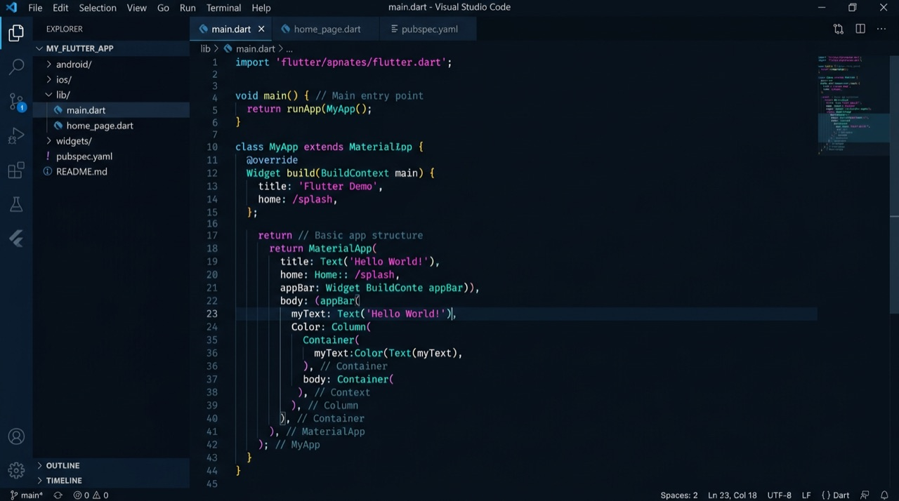
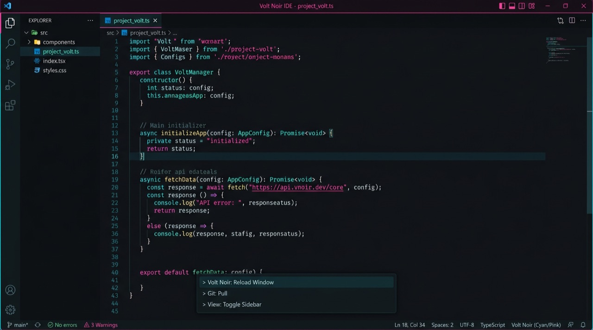

# Nyx

Treize thèmes pour **VS Code** et **Cursor** : sombres bioluminescents et **Ivoire sombre** (bruns chauds), clairs (**Clair**, **Ivoire** `#F6EEDE`), **contraste élevé** ; sémantique LSP, TextMate et workbench harmonisé.

**Éditeur :** [DEKI](https://marketplace.visualstudio.com/publishers/deki) · **Identifiant :** `deki.theme` · **Marketplace :** [Nyx](https://marketplace.visualstudio.com/items?itemName=deki.theme)

---

## Installation

1. Ouvrir la vue **Extensions** (`Ctrl+Shift+X` / `Cmd+Shift+X`).
2. Rechercher **Nyx** et cliquer sur **Install**.

Si l’extension n’est pas disponible sur le Marketplace, installer le fichier **`.vsix`** via **Extensions → Install from VSIX…**.

**Environnement :** VS Code ou Cursor **≥ 1.85**.

---

## Utilisation

**Changer de thème :** **Préférences → Thème de couleur** (ou **Color Theme**), puis choisir une entrée **Nyx** (ex. *Nyx Abîme*, *Nyx Ivoire sombre*, *Nyx Ivoire*, *Nyx Contraste élevé*).

Par défaut, l’extension définit plusieurs réglages via **`configurationDefaults`** (modifiables dans vos réglages utilisateur ou workspace, qui priment toujours) :

| Domaine | Réglages (aperçu) |
|--------|-------------------|
| Thème | `workbench.colorTheme` → **Nyx Minuit** |
| Minimap | activée, curseur / slider **always** |
| Éditeur | coloration sémantique, brackets colorés, guides actifs (vertical + horizontal), indentation active, ligne courante, surlignage des sélections, édition liée, **sticky scroll** |
| Explorateur | repères d’indentation dans l’arbre, badges et couleurs de décorations |

Tout surcharger dans `settings.json` si vous préférez d’autres valeurs.

### Accessibilité

- **Nyx Contraste élevé** — thème `hc-black` : contrastes renforcés, bordures et focus plus visibles.
- **Nyx Clair** — thème clair (`vs`), dérivé d’Abîme.
- **Nyx Ivoire** — clair chaud, fond **#F6EEDE** ; `npm run build:ivoire` après **Nyx Clair**.
- **Nyx Ivoire sombre** — sombre chaud (texte crème, fond espresso) ; `npm run build:ivoire-sombre` après **Nyx Cendre**.

---

## Variantes

| Thème | Description |
|--------|-------------|
| **Nyx** | Référence sombre — bioluminescence cyan / rose. |
| **Nyx Abîme** | Bleu nuit, accents cyan. |
| **Nyx Aube** | Sombres plus ouverts ; syntaxe marquée. |
| **Nyx Baie** | Vert lagune, chrome menthe. |
| **Nyx Brume** | Gris-bleu ardoise ; syntaxe marquée. |
| **Nyx Cendre** | Gris neutre, esprit console. |
| **Nyx Minuit** | Très sombre, adapté aux écrans OLED. |
| **Nyx Nébuleuse** | Violet / mauve. |
| **Nyx Récif** | Cyan vif, bordures néon. |
| **Nyx Clair** | Interface claire (froid / neutre). |
| **Nyx Ivoire** | Clair chaud — base **#F6EEDE**, accents cuivre / ambre. |
| **Nyx Ivoire sombre** | Sombre chaud, complément d’**Ivoire** ; syntaxe alignée sur **Cendre**. |
| **Nyx Contraste élevé** | Mode contraste élevé. |

Les sombres classiques et la base **Nyx** s’appuient sur `include` ; **Clair** / **Ivoire** partagent la syntaxe **Clair** ; **Ivoire sombre** celle de **Cendre**, avec des palettes UI chaudes.

---

## Captures d’écran

---

## Versions

Les changements détaillés sont consignés dans [CHANGELOG.md](./CHANGELOG.md).

---

## Maintenance du dépôt

Réservé à l’équipe qui publie l’extension. Procédures et ordre des scripts : [MAINTENANCE.md](./MAINTENANCE.md).

| Action | Commande |
|--------|----------|
| Valider les fichiers de thème | `npm run validate` ou `make validate` |
| Régénérer **Nyx Clair** puis **Nyx Ivoire** | `npm run build:light` puis `npm run build:ivoire` |
| Régénérer **Nyx Ivoire sombre** | après **Cendre** à jour : `npm run build:ivoire-sombre` |
| Construire le VSIX | `npm run package` ou `make package` |

Intégration continue : validation sur les pull requests ; sur les tags `v*`, génération du VSIX (publication Marketplace possible si le secret `VSCE_PAT` est configuré sur le dépôt).

Publication manuelle Marketplace : `npx @vscode/vsce login deki` puis `npx @vscode/vsce publish --no-dependencies`.
