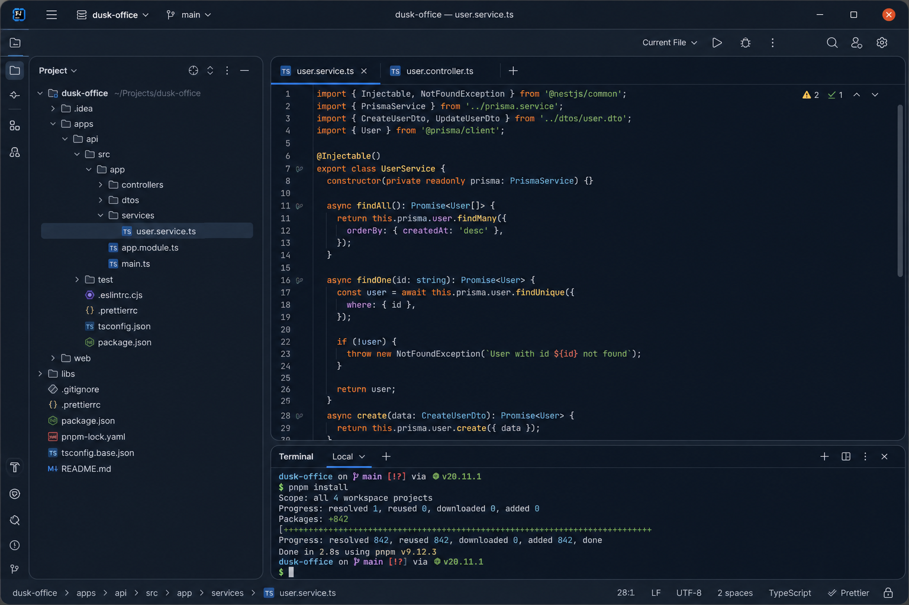
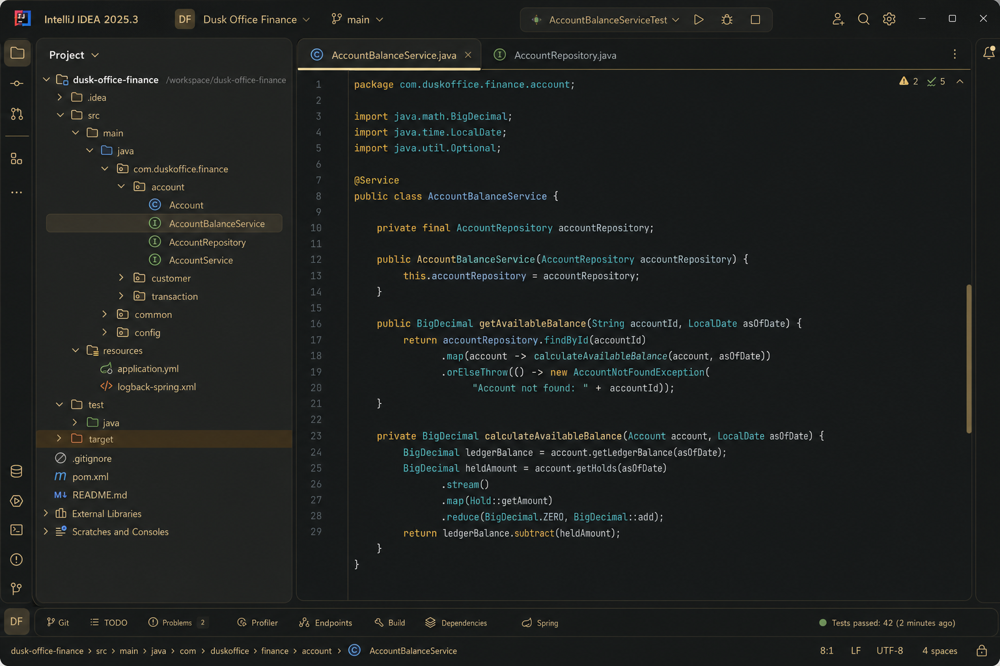
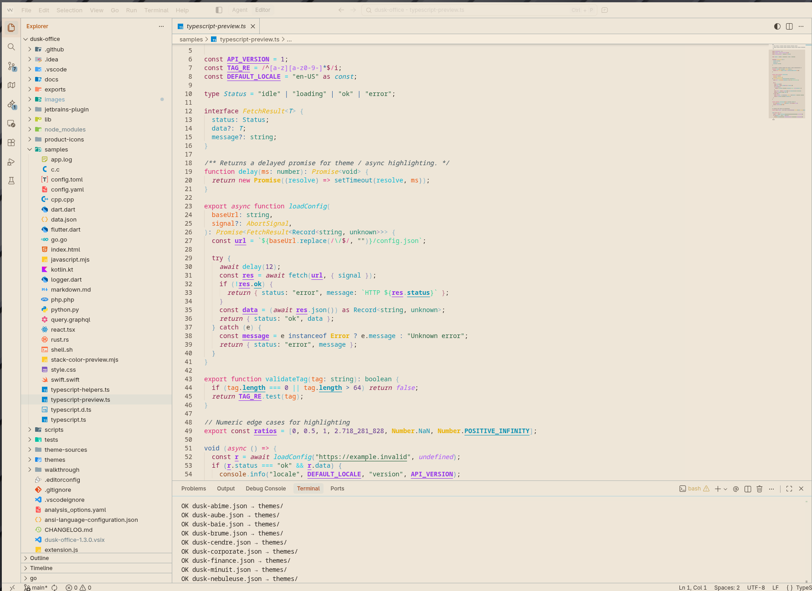

# Dusk Office — JetBrains

[](../LICENSE)
[](https://github.com/SIDIKICONDE/dusk-office/actions/workflows/ci.yml)
[](https://plugins.jetbrains.com/plugin/31875-dusk-office-themes)
[](https://plugins.jetbrains.com/plugin/31875-dusk-office-themes)
[](https://marketplace.visualstudio.com/items?itemName=dekidev.dusk-office)
[](https://marketplace.visualstudio.com/items?itemName=dekidev.dusk-office)
[](https://open-vsx.org/extension/dekidev/dusk-office)
[](https://open-vsx.org/extension/dekidev/dusk-office)

> **Professional theme system for JetBrains IDEs** — the same **27 WCAG-conscious variants** as [VS Code, Cursor and Windsurf](../README.md): **full IDE UI themes** + **editor color schemes**, live-tested terminal contrast, semantic tokens, ANSI colors. Tuned for **finance, audit, cybersecurity, SOC & DevOps**.

**Dusk Office** for JetBrains is the same polished theme suite as [VS Code, Cursor and Windsurf](../README.md): **27 dark, light, and high-contrast variants**, **full UI coverage** (`.theme.json` — toolbars, tabs, tool windows, menus, lists, dialogs) and matching **editor color schemes** (`.icls` — syntax, gutter, terminal ANSI, diff, VCS, debugger). Generated from the parent repo so every editor stays visually aligned.

Built for developers who want readable code, coherent chrome across the IDE shell and editor, OLED-friendly night variants, clean daytime options, and a professional look that survives long finance, audit, SOC, and DevOps sessions.

**Why Dusk Office on JetBrains:**

- **One family, 27 variants** — dark, light, warm, and high-contrast options that still feel related instead of random skins
- **Full IDE coverage** — UI theme + color scheme designed together, not editor-only skins
- **Readable by design** — terminal ANSI, diff/VCS, and syntax tuned for long sessions; same contrast pipeline as VS Code
- **Cross-IDE identity** — same palettes as the VS Code / Cursor / Windsurf extension and [Open VSX](https://open-vsx.org/extension/dekidev/dusk-office)
- **Trust-first behavior** — no telemetry, no network calls; themes are static resources in the plugin

This **README** is the JetBrains plugin documentation (GitHub and Marketplace listing). **Public documentation mirror:** [github.com/SIDIKICONDE/dusk-office-docs](https://github.com/SIDIKICONDE/dusk-office-docs). Extended guide — full theme list, terminal palettes, contrast notes — [QUICKSTART-LONG.md](../QUICKSTART-LONG.md#included-themes) · [same file on the docs repo](https://github.com/SIDIKICONDE/dusk-office-docs/blob/main/QUICKSTART-LONG.md#included-themes).

**Marketplace:** [Dusk Office Themes — plugin 31875](https://plugins.jetbrains.com/plugin/31875-dusk-office-themes) · **VS Code / Cursor / Windsurf:** [dekidev.dusk-office](https://marketplace.visualstudio.com/items?itemName=dekidev.dusk-office)

---

## Screenshots

**IntelliJ IDEA** — full UI theme + editor color scheme (Islands UI, flat toolbar):

| Dusk Office Midnight | Dusk Office Finance |
| :---: | :---: |
|  |  |

**Same palettes in VS Code / Cursor / Windsurf:**

| Dusk Office Midnight | Dusk Office Abyss | Dusk Office Nocturne |
| :---: | :---: | :---: |
|  |  |  |

| Dusk Office Finance | Dusk Office Ivory |
| :---: | :---: |
|  |  |

---

## Install

**From JetBrains Marketplace:**

1. **Settings → Plugins → Marketplace** → search `Dusk Office` → **Install**
2. Restart the IDE
3. **Settings → Appearance → Theme** → pick any **Dusk Office …** variant

**From ZIP (local build):**

```bash
# From repo root after: npm run jetbrains:build
npm run jetbrains:install
```

---

## Switch Theme

**Settings (recommended):**

1. **Settings → Appearance → Theme** → **Dusk Office …** (full UI + editor, e.g. **Dusk Office Terminal**)
2. After a variant change: **restart the IDE once**, then confirm **Appearance → Theme** and **Editor → Color Scheme** show the **same name**

**Find Action:**

1. `Cmd/Ctrl + Shift + A` → type `Theme` → **Theme…** (UI)
2. Or `Color Scheme` → **Color Scheme…** (editor only)

**Editor only** (if you keep another UI theme):

- **Settings → Editor → Color Scheme** → **Dusk Office …** with the **same variant name** as your UI theme

---

## Pick a Variant

| If you want... | Use |
| --- | --- |
| Very dark, OLED-friendly | **Dusk Office Midnight** |
| Vivid blue-cyan contrast | **Dusk Office Abyss** |
| Warm vintage terminal | **Dusk Office Nocturne** |
| Premium banking aesthetic | **Dusk Office Finance** |
| Electric graphite + neon lime focus | **Dusk Office Voltage** |
| Cyberpunk magenta + electric blue | **Dusk Office Neon** |
| Luxury obsidian + champagne gold | **Dusk Office Luxe** |
| Hacker phosphor green on black | **Dusk Office Terminal** |
| Professional dark for long sessions | **Dusk Office Steward** |
| Soft finance light with reduced glare | **Dusk Office Ledger** |
| Calm security / SOC dark theme | **Dusk Office Secure** |
| Banking / treasury / executive operations | **Dusk Office Vault** |
| Audit / controls / long spreadsheet review | **Dusk Office Audit** |
| Cybersecurity / SOC / monitoring | **Dusk Office Sentinel** |
| Light / daytime | **Dusk Office Ivory** |
| High contrast / accessibility | **Dusk Office High Contrast** |

Full list of 27 variants: [Included Themes](../QUICKSTART-LONG.md#included-themes) · [on GitHub](https://github.com/SIDIKICONDE/dusk-office-docs/blob/main/QUICKSTART-LONG.md#included-themes).

---

## JetBrains Tips

**100% uniform toolbar** — JetBrains may show a **project color gradient** on the toolbar (generated from the project name; not overridable by themes). For a flat Dusk Office look:

- **Settings → Appearance & Behavior → Appearance** → disable **Show project gradient in toolbar** / **Color the toolbar by project**
- Older IDEs: **Help → Find Action → Registry** → disable `ide.colorful.toolbar`, then restart

**Rounded corners (IntelliJ 2025.3+)** — Dusk Office targets the **Islands** UI (`Island.*`, `targetUi="islands"`). On older builds you get classic rectangular panels. Schemes do **not** use `parentTheme: Islands Dark` (that would lock editor/terminal to JetBrains defaults).

**Terminal (2025.2+)** — ANSI via `BLOCK_TERMINAL_*` in each scheme; `editorScheme` matches the scheme name (e.g. `Dusk Office Finance`).

---

## Next Steps

- VS Code / Cursor / Windsurf extension: [main README](../README.md)
- Changelog: [CHANGELOG.md](../CHANGELOG.md) · [mirror](https://github.com/SIDIKICONDE/dusk-office-docs/blob/main/CHANGELOG.md)
- **Color harmony & eye comfort** — how variants stay coherent (chrome vs editor, terminal blend, contrast checks): [MAINTENANCE.md](../MAINTENANCE.md) (section *Color harmony & eye comfort*)
- **Terminal contrast** — same WCAG checks as VS Code (`audit-contrast.mjs`, `verify-terminal-contrast.mjs` on export). Details: [Terminal Contrast](../QUICKSTART-LONG.md#check-contrast)
- **Other editors** — Neovim, Emacs, Zed, Helix: [exports/README.md](../exports/README.md)
- **Build or publish this plugin** — [For developers](#for-developers) below

---

## FAQ

**Is Dusk Office a dark theme or a light theme?**
Both. The pack ships **27 variants** — dark (Midnight, Abyss, Nocturne, Vault, Sentinel, Steward, Terminal, Voltage, Neon, Luxe, Finance, Corporate, Secure, Mist, Ash, Bay, Reef, Nebula, Dawn, Or, Ivoire Sombre), **light** (Light, Ivory, Ledger, Audit) and **high contrast** (Dusk Office High Contrast) — all sharing the same Dusk Office identity.

**Which JetBrains IDEs are supported?**
**IntelliJ IDEA**, **PyCharm**, **WebStorm**, **Rider**, **CLion**, **GoLand**, **PhpStorm**, **RubyMine**, **DataGrip**, **RustRover**, **Android Studio**, and other platform-based IDEs (see `pluginSinceBuild` in `gradle.properties`).

**UI theme vs color scheme — which should I pick?**
Use **Appearance → Theme** for the full experience. Use **Editor → Color Scheme** only if you intentionally keep a different UI theme but want Dusk Office syntax and terminal colors.

**Is this the same pack as VS Code / Cursor / Windsurf / Open VSX?**
Yes — 27 variants from the same sources. The VS Code extension adds **workspace fingerprint**, **adaptive focus**, **auto day/night switch**, and a **Control Center** ([main README](../README.md)); the JetBrains plugin ships static themes only.

**Does it work with Islands / Reworked terminal?**
Yes. Islands styling comes from `Island.*` + `targetUi="islands"` without inheriting JetBrains default Islands Dark editor/terminal colors.

**Is the terminal contrast WCAG-conscious?**
Yes. Themes are validated with the same export pipeline as VS Code (`terminal.foreground` and 16 ANSI colors). See [Terminal Contrast](../QUICKSTART-LONG.md#check-contrast).

**Is Dusk Office colorblind-friendly?**
Critical UI signals (errors, warnings, modified, diff, VCS) use hue separation, not just red/green. See [MAINTENANCE.md](../MAINTENANCE.md) → *Color harmony & eye comfort*.

**Does it track me?**
No telemetry, no network calls. Themes are bundled resources only.

**Why use Dusk Office over Darcula, One Dark, Monokai or Material Theme?**
Dusk Office is a **domain-tuned theme suite**: variants for **finance / fintech / banking / audit** (Vault, Ledger, Audit, Finance), **cybersecurity / SOC** (Sentinel, Secure), **DevOps** (Voltage, Terminal), **long sessions** (Steward, Midnight), with **WCAG-conscious terminal contrast** and the **same identity** across VS Code, Cursor, Windsurf, Open VSX and JetBrains.

---

## Keywords / Tags

dark theme · light theme · high contrast theme · theme pack · color theme · vscode theme · cursor theme · windsurf theme · open vsx theme · jetbrains theme · intellij theme · pycharm theme · webstorm theme · rider theme · clion theme · goland theme · phpstorm theme · rubymine theme · datagrip theme · rustrover theme · android studio theme · accessible theme · colorblind friendly · wcag theme · oled theme · eye comfort · professional theme · finance theme · fintech theme · banking theme · audit theme · cybersecurity theme · soc theme · devops theme · ml theme · data science theme · semantic highlighting · adaptive theme · auto dark mode · day night switch · ansi colors · terminal theme · product icon theme · theme bundle

---

## Also by the same developer

**🛠️ [NythyCleaner](https://nythycleaner.cloud)** — Native macOS utility for developers. Xcode cleanup, disk scanner, AI duplicate detection, real-time monitoring.

[](https://nythycleaner.cloud)

---

## For developers

<details>
<summary>Build, publish, and regenerate the plugin</summary>

### Prerequisites

- **JDK 17** for Gradle (Gradle does not run on Java 25 alone; CI uses Java 17)
- Exported themes from repo root: `npm run export:ide`

**Java 25 only on the system:**

```bash
# Fedora
sudo dnf install -y java-17-openjdk java-17-openjdk-devel
export JAVA_HOME=/usr/lib/jvm/java-17-openjdk

# Or local JDK 17 (no sudo)
export JAVA_HOME=$HOME/.local/jdk-17
export PATH="$JAVA_HOME/bin:$PATH"
```

**IntelliJ: “Project source sets cannot be resolved”**

1. **Settings → Build Tools → Gradle → Gradle JVM** → **JDK 17**
2. Or `jetbrains-plugin/local.properties`:
   ```properties
   org.gradle.java.home=/path/to/jdk-17
   ```
   (`npm run jetbrains:sync` can generate this when `~/.local/jdk-17` exists)
3. **Reload Gradle Project** or **Invalidate Caches → Restart**

### Build local

```bash
# From repo root
npm run jetbrains:sync       # exports/jetbrains → colors/ + plugin.xml
npm run jetbrains:build      # ./gradlew buildPlugin → build/distributions/*.zip
npm run jetbrains:install    # copy ZIP to ~/…/JetBrains/…/plugins/
npm run jetbrains:upgrade    # build + install
npm run jetbrains:full       # regenerate themes + build + install
```

```bash
make jetbrains-reinstall
make jetbrains-full
make jetbrains-install IDE=auto
node scripts/install-jetbrains-plugin.mjs --list
```

Sandbox IDE (no system install):

```bash
cd jetbrains-plugin && ./gradlew runIde
```

After VS Code theme changes: `npm run export:ide && npm run jetbrains:sync` then rebuild.

### Publish to JetBrains Marketplace

1. [JetBrains Marketplace](https://plugins.jetbrains.com) account (vendor **dekidev**)
2. **Tokens** → publication token → GitHub secret `JETBRAINS_TOKEN` (or local env)
3. Tag `v*`: `release.yml` publishes when the secret is set

```bash
export JETBRAINS_TOKEN="…"
npm run jetbrains:publish
# or: cd jetbrains-plugin && ./gradlew publishPlugin
```

First upload: [Upload plugin](https://plugins.jetbrains.com/author/me/plugins) → `build/distributions/dusk-office-jetbrains-*.zip`

### Generated files (do not edit by hand)

| File | Source |
| --- | --- |
| `src/main/resources/colors/*.icls` | `exports/jetbrains/` via `jetbrains:sync` |
| `src/main/resources/META-INF/plugin.xml` | `scripts/sync-jetbrains-plugin.mjs` |
| `src/main/resources/META-INF/pluginIcon.svg` | copied from `images/icon.png` via `jetbrains:sync` (Marketplace + Plugin Manager) |
| `gradle.properties` (`pluginVersion`) | `package.json` |

### Plugin IDs

| | |
| --- | --- |
| **Marketplace name** | Dusk Office Themes |
| **Plugin ID** | `com.dekidev.dusk.office` |
| **Display name** | Dusk Office |
| **Listing** | [plugin/31875](https://plugins.jetbrains.com/plugin/31875-dusk-office-themes) |

</details>
